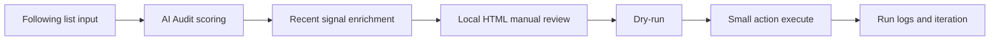

# x-following-audit

中文版本: [README.zh.md](./README.zh.md)

Many creators/operators hit the same problem: following lists silently bloat over time, low-activity accounts accumulate, and timeline signal quality drops.

Recent X algorithm discussions suggest recommendation quality is tightly tied to interaction patterns and interest graph. Following composition may not directly determine recommendations, but it can shape what you consume and interact with over time (treat this as a practical hypothesis to validate, not an absolute claim).

This project turns that pain into a safer workflow: AI-assisted list audit -> human review -> small, conservative actions.

## Why this exists (pain point)

- Manual review of large following lists does not scale.
- Account activity/relevance drifts over time; old follows become stale.
- Most tools focus on execution speed, not review quality and risk control.
- Users often need safer hygiene workflows, not aggressive automation.

## Workflow diagram



## Core features

- Read-only following audit with conservative scoring.
- Human-review HTML board before any action.
- Safe action runner with dry-run default and small-batch design.
- Optional live fetch with `xreach`, but not required for demo flow.

## Following Audit Pipeline

### What you get

- **Static risk scoring** — classify following accounts into `keep`, `maybe`, and `unfollow_candidate`.
- **Recent-signal enrichment** — reduce false positives by checking recent activity/content before action.
- **Local HTML review board** — search, filter, and manually export approved handles.
- **Safe action runner** — default `dry-run`, random delay, small-batch execution, and per-run JSON logs.

### How it works

You run a read-only audit first, then manually review candidates in a local HTML page, then apply only approved actions in small batches.  
The execution step is designed to be conservative by default (`dry-run` first, explicit `--execute` required).

```text
You: I follow too many accounts and want to prune low-signal ones safely.

AI/workflow output:
1) following_audit_*.json with score buckets
2) following_audit_*_recent.json after recent enrichment
3) following_audit_*_recent.html for manual review
4) batch run log unfollow_run_*.json (dry-run or execute)
```

### Setup

**Claude Code:**
```bash
git clone https://github.com/runesleo/x-following-audit.git
cd x-following-audit
npm install
```

**Terminal (local):**
```bash
mkdir -p data/following_audit
cp samples/approved_unfollow.sample.txt data/following_audit/approved_unfollow.txt
cp samples/keep_overrides.sample.txt data/following_audit/keep_overrides.txt
```

**Any other AI agent:**
Use the same script pipeline directly from shell. No IDE-specific runtime is required.

### Quick start paths

**Path A (no xreach, easiest):**
- Start from an existing audit JSON (your own export or sample data).
- Run `render_following_audit_html.py` directly, then dry-run the action runner.
- Optional: run `following_recent_audit.py` only when `xreach` is available.
- Example:
  ```bash
  cp samples/following_audit.sample.json data/following_audit/following_audit_demo.json
  python3 scripts/render_following_audit_html.py data/following_audit/following_audit_demo.json
  ```

**Path B (with xreach, full auto-fetch):**
- Use `following_audit.py --handle <your_handle>` to fetch live following list first.
- Continue with the same review and execution flow.

### Requirements

- Node.js 18+ (for `puppeteer` executor)
- Valid X session cookie file at `data/x_cookies.json` (`auth_token`, `ct0`)
- `xreach` is optional but recommended for automatic live fetch
- That's it. Keep batches small and reviewed.

> Cookie safety: treat `data/x_cookies.json` as account credentials. Never commit or share it, and use restrictive permissions (e.g. `chmod 600 data/x_cookies.json`).

### Supported input

| Input | Example | Resolution |
|-------|---------|------------|
| Target handle | `--handle runes_leo` | Fetches following pages via `xreach following` |
| Static audit file | `following_audit_20260521_124427.json` | Enriched into `_recent.json` |
| Approved handle list | `@handle_a` per line | Consumed by safe action runner |
| Keep overrides | `@never_unfollow` per line | Forces keep / skips execution |

### Data sources

| API / Source | What it provides |
|-----|-----------------|
| `xreach following` | Following list and profile metadata |
| `xreach tweets` | Recent activity/content signal for low-confidence accounts |
| X web session cookies (`auth_token`, `ct0`) | Browser-authenticated action context for batch execution |

### Known limitations (v0.1.0)

- Relies on login-session automation, not official stable X API contracts.
- UI/API changes on X can break unfollow button detection.
- High-frequency execution is intentionally unsupported by design.
- If you do not use `xreach`, you need to provide audit JSON input yourself.
- You are responsible for complying with X Terms and automation policies.

## Roadmap

**Scoring quality**
- [ ] Add optional domain-specific keyword packs — adapt scoring to different niches.
- [ ] Add lightweight false-positive feedback loop — improve subsequent suggestions.

**Safety controls**
- [ ] Add explicit daily quota guard in executor — hard stop after configurable count.
- [ ] Add preflight login-state probe command — fail fast before batch runs.

**Review UX**
- [ ] Add diff view between static and recent scores — faster final decisions.
- [ ] Add export presets (`red-only`, `manual-review`) — fewer manual clicks.

**API** (planned)
- [ ] REST API for all tools above — integrate into your own apps.

## About the author

*Leo ([@runes_leo](https://x.com/runes_leo)) — AI × Crypto independent builder. Trading on [Polymarket](https://polymarket.com/?r=githuball&via=runes-leo&utm_source=github&utm_content=x-following-audit), building data and trading systems with Claude Code and Codex.*

*[leolabs.me](https://leolabs.me) — writing · community · open-source tools · indie projects · all platforms.*

*[X Subscription](https://x.com/runes_leo/creator-subscriptions/subscribe) — paid content weekly, or just buy me a coffee 😁*

*Learn in public, Build in public.*
