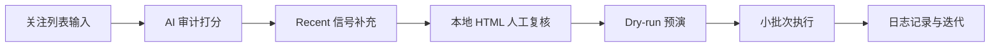

# x-following-audit

English: [README.md](./README.md)

很多人会遇到同一个问题：  
不知不觉关注列表越来越大，里面混入了不少低活跃、低相关账号，时间线信噪比持续下降。

结合近期 X 算法讨论，推荐分发与兴趣信号强相关。关注列表不一定直接决定推荐，但它会影响你日常消费与互动结构，进而影响你看到的内容质量（这点仍建议持续实测，而不是绝对化断言）。

这个仓库的目标是：用 AI 先做关注列表体检，再人工复核，把“关系整理”做成低风险、可重复的流程。  
不是做高频自动化，而是做信息质量管理。

## 为什么做这个（痛点）

- 关注列表越滚越大，手动逐个检查成本极高。
- 账号活跃度和内容相关性变化快，旧关注会持续老化。
- 很多人需要的不是“批量动作”，而是“先筛选、再确认”的保守流程。
- 公开工具里常见的是执行导向，缺少审计与复核这一层。

## 流程图（Workflow）



## 核心功能

- 只读审计：先评分，不先执行动作。
- 人工复核：本地 HTML 页面筛选与导出清单。
- 安全动作执行：默认 dry-run，小批次、随机间隔。
- 可选增强：支持 `xreach` 实时拉取，但不是硬依赖。

## 关注审计流水线

### What you get

- **静态打分分桶** — 把关注对象分成 `keep`、`maybe`、`unfollow_candidate`。
- **Recent 二次校验** — 对低置信账号补一层近期内容/活跃信号。
- **本地 HTML 审核页** — 支持搜索、筛选、勾选并导出执行清单。
- **安全动作执行器** — 默认 `dry-run`，随机间隔，小批次执行；真实执行需强确认并受每日配额约束。

### How it works

先跑只读审计，得到初筛结果；再用 recent 信号降低误伤；最后在本地 HTML 人工确认清单，再执行小批次动作。  
执行阶段默认不会真的取关，必须显式传 `--execute`。

```text
你: 我关注太多了，想安全清理掉低价值账号。

流程输出:
1) following_audit_*.json（静态分数）
2) following_audit_*_recent.json（recent 增强）
3) following_audit_*_recent.html（人工审核）
4) unfollow_run_*.json（执行日志）
```

### Setup

**Claude Code:**
```bash
git clone https://github.com/runesleo/x-following-audit.git
cd x-following-audit
npm install
```

**本地终端:**
```bash
mkdir -p data/following_audit
cp samples/approved_unfollow.sample.txt data/following_audit/approved_unfollow.txt
cp samples/keep_overrides.sample.txt data/following_audit/keep_overrides.txt
```

**Any other AI agent:**
直接调用同一套 shell 命令即可，不依赖特定 IDE 运行时。

### Quick start 路径

**路径 A（不装 xreach，最亲民）：**
- 直接从已有的 `following_audit_*.json` 开始（自己的导出文件或样例）。
- 直接跑 `render_following_audit_html.py` 生成审核页，然后 dry-run。
- 如果你装了 `xreach`，再追加 `following_recent_audit.py` 做二次校验。
- 示例：
  ```bash
  cp samples/following_audit.sample.json data/following_audit/following_audit_demo.json
  python3 scripts/render_following_audit_html.py data/following_audit/following_audit_demo.json
  ```

**路径 B（装 xreach，全自动拉取）：**
- 先跑 `following_audit.py --handle <your_handle>` 抓取实时 following。
- 后续和路径 A 一样。

### Requirements

- Node.js 18+（执行 `puppeteer` 脚本）
- 可用的 `data/x_cookies.json`（`auth_token` / `ct0`）
- `xreach` 是可选增强项（用于自动抓取实时 following）
- 就这些。请坚持小批次 + 人工复核。

> Cookie 安全提示：`data/x_cookies.json` 等同账号凭证，不要提交、不要分享，建议执行 `chmod 600 data/x_cookies.json`。

### Supported input

| 输入 | 示例 | 作用 |
|-------|---------|------------|
| 目标账号 | `--handle your_handle` | 拉取 following 列表 |
| 静态审计文件 | `following_audit_20260521_124427.json` | 生成 recent 增强版 |
| 执行清单 | 每行一个 `@handle` | 安全动作执行输入 |
| 白名单 | 每行一个 `@handle` | 强制保留 / 执行跳过 |

### Data sources

| 数据源 | 提供内容 |
|-----|-----------------|
| `xreach following` | 关注列表和基础画像 |
| `xreach tweets` | 候选账号近期内容与活跃信号 |
| X 登录态 cookie | 批执行阶段的网页登录上下文 |

### Known limitations (v0.1.0)

- 基于登录态自动化，不是官方稳定 API 协议。
- X 页面或接口变动可能导致按钮识别失效。
- 本项目刻意不支持高频、大规模自动执行。
- 不用 `xreach` 时，需要你自己提供审计 JSON 作为输入。
- 你需要自行确认符合 X 平台条款与自动化政策。

## Roadmap

**评分质量**
- [ ] 增加可插拔关键词包 — 适配不同赛道。
- [ ] 增加误判反馈回路 — 提升下一批建议质量。

**安全控制**
- [x] 增加每日动作硬上限 — 超限自动停止。
- [ ] 增加执行前登录态探针命令 — 先验状态再开跑。

**审核体验**
- [ ] 增加 static vs recent 分数对比视图 — 更快复核。
- [ ] 增加一键导出预设（红区/人工复核）— 减少手工操作。

**API（规划中）**
- [ ] 提供覆盖上述工具的 REST API，便于接入你自己的应用。

## About the author

*关于作者：Leo ([@runes_leo](https://x.com/runes_leo))，AI × Crypto 独立构建者。在 [Polymarket](https://polymarket.com/?r=githuball&via=runes-leo&utm_source=github&utm_content=x-following-audit) 做量化交易，用 Claude Code 和 Codex 搭建数据分析与自动化交易系统。*

*[leolabs.me](https://leolabs.me)：文章 · 社群 · 开源工具 · 独立项目 · 全平台账号*

*[X 订阅](https://x.com/runes_leo/creator-subscriptions/subscribe)：付费内容周更，或请我喝杯咖啡 😁*

*Learn in public, Build in public.*
